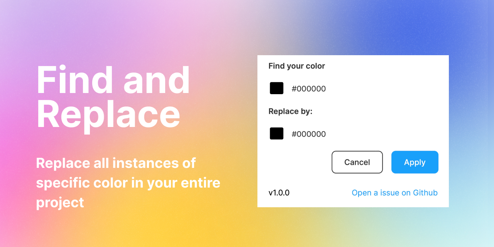

**Table of Contents:**

* [Find and Replace](#find-and-replace)
* [User Guide](#user-guide)
* [Contribution](#contribution)
* [Project setup](#project-setup)

# Find and Replace

A Figma plugin that give you the ability to to find all instance of a specific color and replace it by another one in your entire project files.
## User Guide

When running the plugin, you will be prompted to seclect two colors. The first one is the color you want to find and the second one is the color you want to replace it with. You can type the hexadecimal code or use the color picker to make your selection.

## Contribution

You can contribute to this project by:
- creating an issue
- starting a discussion
- sharing ideas
- etc

Please reade our[ code of conduct](https://github.com/maximedaraize/find-and-replace/blob/develop/.github/CODE_OF_CONDUCT.md)

## Project setup

Below are the steps to get your plugin running. You can also find instructions at:

  https://www.figma.com/plugin-docs/setup/

This plugin template uses Typescript and NPM, two standard tools in creating JavaScript applications.

First, download Node.js which comes with NPM. This will allow you to install TypeScript and other
libraries. You can find the download link here:

  https://nodejs.org/en/download/

Next, install the dependencies

```bash
pnpm install
```

Then to run the project run:

```bash
pnpm run dev
```

and voilà 🎉


