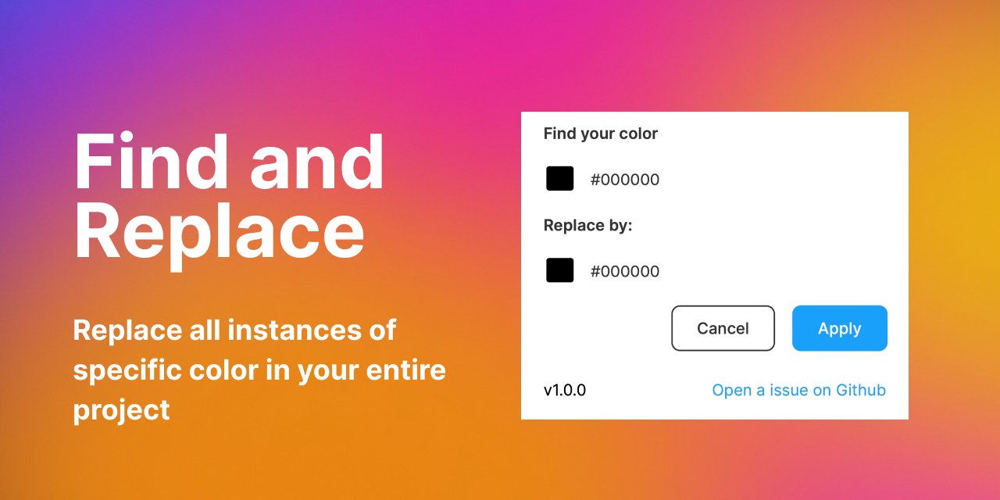

**Table of Contents:**

* [Find and Replace](#find-and-replace)
* [User Guide](#user-guide)
* [Contribution](#contribution)
* [Project setup](#project-setup)

# Find and Replace

A Figma plugin that give you the ability to to find all instance of a specific color and replace it by another one in your entire project files.
## User Guide

When running the plugin, you will be prompted to seclect two colors. The first one is the color you want to find and the second one is the color you want to replace it with. You can type the hexadecimal code or use the color picker to make your selection.

## Contribution

You can contribute to this project by:
- creating an issue
- starting a discussion
- sharing ideas
- etc

Please reade our[ code of conduct](https://github.com/maximedaraize/find-and-replace/blob/develop/.github/CODE_OF_CONDUCT.md)

## Project setup

Below are the steps to get your plugin running. You can also find instructions at:

  https://www.figma.com/plugin-docs/setup/

This plugin template uses Typescript and NPM, two standard tools in creating JavaScript applications.

First, download Node.js which comes with NPM. This will allow you to install TypeScript and other
libraries. You can find the download link here:

  https://nodejs.org/en/download/

Next, install TypeScript using the command:

  npm install -g typescript

Finally, in the directory of your plugin, get the latest type definitions for the plugin API by running:

  npm install --save-dev @figma/plugin-typings

If you are familiar with JavaScript, TypeScript will look very familiar. In fact, valid JavaScript code
is already valid Typescript code.

TypeScript adds type annotations to variables. This allows code editors such as Visual Studio Code
to provide information about the Figma API while you are writing code, as well as help catch bugs
you previously didn't notice.

For more information, visit https://www.typescriptlang.org/

Using TypeScript requires a compiler to convert TypeScript (code.ts) into JavaScript (code.js)
for the browser to run.

We recommend writing TypeScript code using Visual Studio code:

1. Download Visual Studio Code if you haven't already: https://code.visualstudio.com/.
2. Open this directory in Visual Studio Code.
3. Compile TypeScript to JavaScript: Run the "Terminal > Run Build Task..." menu item,
    then select "npm: watch". You will have to do this again every time
    you reopen Visual Studio Code.

That's it! Visual Studio Code will regenerate the JavaScript file every time you save.

